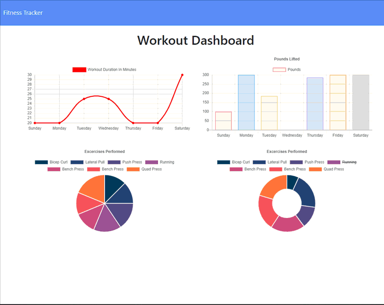

# Mongodb Fitness Tracker
This intricately coded fitness tracker allows you to add cardio or resistance exercises and routines as well as keep track of your week of workouts on a cool Workout Dashboard.  For this class assignment we had to create the backend of the app using mvc, a mongodb database and MongoDB Atlas. We used Robo 3T (formerly Robomongo) free open-source MongoDB GUI for the project. Completing the file stucutre consisted of adding a controller folder with an api-controller.js with all the get put and post routes and html-controller.js which uses path to route to the stats and exercise html in the public folder.  We needed to create a models folder with an index.js and workout.js which gets the schema data as well as a server.js set up to run express, mongoose and morgan and then link them all together. This app can run in a local port or on heroku the way the server.js is set up. 

## GitHub Repo
https://github.com/MacParthum/Fitness_Tracker

## Heroku Deployed App
https://tranquil-lowlands-19905.herokuapp.com/?id=5f6d537a4355c50017e35920

## Image of Deployed Site
